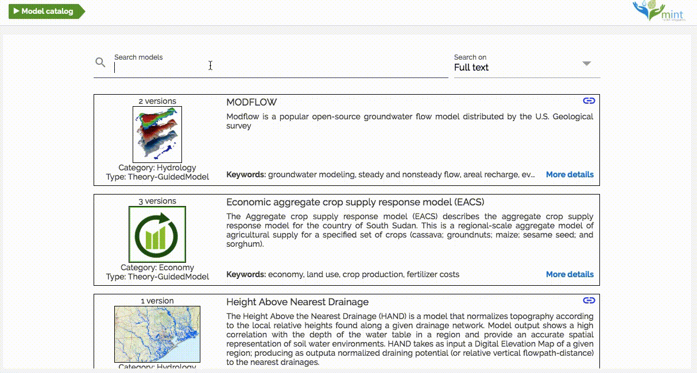

# Usage

## Browse and search a Model Configuration

To explore the models in MINT Model Catalog. You can go to the website [https://models.mint.isi.edu/](https://models.mint.isi.edu) or type:

```bash
$ mint browse
```




Select the [ModelConfiguration](https://mintproject.readthedocs.io/en/latest/modelcatalog/#model-configuration) or the [ModelConfigurationSetup](https://mintproject.readthedocs.io/en/latest/modelcatalog/#model-configuration-setup) to run


## Run a Model Configuration Setup

Open a terminal and run it.

```bash
$ mint run cycles-0.10.2-alpha-collection-oromia-single-point
```

### Fully configured ModelConfigurationSetup

Since some [ModelConfigurationSetup](https://mintproject.readthedocs.io/en/latest/modelcatalog/#model-configuration-setup) has all input files initialized by expert users, you must not provide the location of the inputs.

For example, the ModelConfigurationSetup [cycles-0.10.2-alpha-collection-oromia-single-point](https://models.mint.isi.edu/models/explore/CYCLES/cycles_v0.10.2_alpha/cycles-0.10.2-alpha-collection/cycles-0.10.2-alpha-collection-oromia-single-point).

[](https://asciinema.org/a/ZhVn1dI5NBIzaaWGaIlD563Cj)

### Not fully configured ModelConfigurationSetup

A [ModelConfiguration](https://mintproject.readthedocs.io/en/latest/modelcatalog/#model-configuration) and some [ModelConfigurationSetup](https://mintproject.readthedocs.io/en/latest/modelcatalog/#model-configuration-setup) allow to the user to provide the location of the inputs. Then, you must provide the location of the inputs.

For example, [cycles-0.10.2-alpha-collection-oromia](https://models.mint.isi.edu/models/explore/CYCLES/cycles_v0.10.2_alpha/cycles-0.10.2-alpha-collection/cycles-0.10.2-alpha-collection-oromia).


