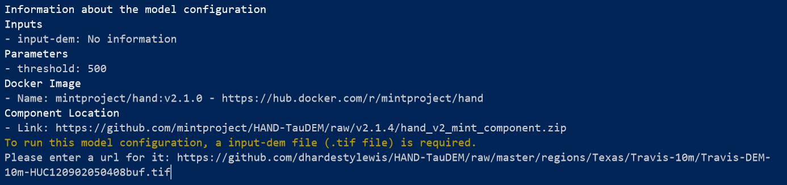

# Usage

DAME was designed to test and run the different models available for execution in the [MINT model catalog](https://models.mint.isi.edu). We distinguish [model configurations](https://mintproject.readthedocs.io/en/latest/modelcatalog/#model-configuration), which allow for users to select the files needed in the execution; and  [model configuration setups](https://mintproject.readthedocs.io/en/latest/modelcatalog/#model-configuration-setup), which are already prepared with default files and parameters to run.

## Browse and search a Model Configuration

To explore the models in MINT Model Catalog. You can go to the website [https://models.mint.isi.edu/](https://models.mint.isi.edu) or type:

```bash
$ dame browse
```


Select the [Model Configuration](https://mintproject.readthedocs.io/en/latest/modelcatalog/#model-configuration) or the [Model Configuration Setup](https://mintproject.readthedocs.io/en/latest/modelcatalog/#model-configuration-setup) to run


## Run a Model Configuration 

Open a terminal and type:

```bash
$ dame run <model id>
```
Where `<model id>` correspods to the id of the model configuration you want to run. For example, the id `hand_v2_raster` will prepare the execution of the HAND model by asking for the required input files:

```bash
$ dame run hand_v2_raster
```
Dame response:


In this case, DAME is requesting the input DEM required to run the model. In this example, we used: [https://github.com/dhardestylewis/HAND-TauDEM/raw/master/regions/Texas/Travis-10m/Travis-DEM-10m-HUC120902050408buf.tif](https://github.com/dhardestylewis/HAND-TauDEM/raw/master/regions/Texas/Travis-10m/Travis-DEM-10m-HUC120902050408buf.tif)

After adding the input, we should see:

```bash
$ The information of the setup is complete
Executing the setup
```
And a link to where to find the logs and results when finished.

!!! info
    DAME will currently run all parameters of a configuration or setup with their default values.

## Run a fully configured Model Configuration Setup

Since some [Model Configuration Setups](https://mintproject.readthedocs.io/en/latest/modelcatalog/#model-configuration-setup) have all input files assigned by expert users, you don't have to provide the location of the inputs.

For example, the Model Configuration Setup [cycles-0.10.2-alpha-collection-oromia-single-point](https://models.mint.isi.edu/models/explore/CYCLES/cycles_v0.10.2_alpha/cycles-0.10.2-alpha-collection/cycles-0.10.2-alpha-collection-oromia-single-point) is already prepared to execute an agriculture model in a specific region of Ethiopia. The following video shows how DAME would excute the model.

[](https://asciinema.org/a/ZhVn1dI5NBIzaaWGaIlD563Cj)
